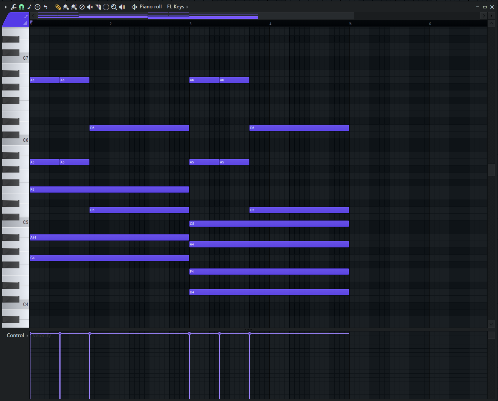

# *Beginner's Quick Guide to FL Studio*
## Tim Saunders

Below is a quick demonstration of how to get started in creating music with FL Studio. It covers the basic UI elements, commonly used menus, and other things that are worth getting familiar with. This tutorial will cover how to find instruments and samples, sequence them into a song using the workspace, add effects, and export the final project. This tutorial is meant to be helpful to anyone looking to learn how to make music without any prior knowledge of FL studio or any DAW.

# Creating a project
If you are loading up FL Studio for the first time, it will load an example project file as a showcase. A blank project can be created by clicking File (located in the top left) and selecting New(Empty). The program will then show you a screen something like this:

The UI elements that are numbered are the UI elements that you will need to utilize in order to create songs. They are listed below:
1. **Tempo** - This is where you adjust the tempo of your project. You may click and drag up and down to adjust it, or right click and enter a value manually. To the left of it are the play/stop/record butons, and the PAT/SONG switch to the furthest left determines if the program will play/stop/record the selected pattern or the overall song.
2. **Browser** - This is where you find the samples and instruments to use in your songs. FL Studio comes with some stock instruments and packs, but you can add your own sounds by adding a folder to the browser's file location on your pc or by going to Options (at the top left) > File Settings > Browse extra search folders and entering your sample pack file.
3. **Channel Rack** - The channel rack allows you to create and edit individual patterns to then be placed in the main workspace. You can bring in samples by clicking and dragging from the browser.
4. **Picker** - From here you can select patterns, sounds, or automation clips to place in the workspace.
5. **Workspace** - This is where the overall song is played from. You can drag in samples or sounds from the picker to sequence them in the workspace.
6. **Mixer** - The mixer is an emulation of a studio mixer board. Indivudal tracks can be programmed to each insert, allowing you to add effects, adjust volume and panning, and much more.

# Using the channel rack to create a drum pattern
The first thing we will do is create a drum pattern using the channel rack. Navigate through the browser and find the folder that contains all the drum samples:

You can drag samples from there into the channel rack (notice the kick, snare, and hat):

Each sample has a line of notches to its right which are used to program the drums. One notch will play every 1/4 beat, since our project is in 4/4 by default. Left click on a notch to activate and right click to deactivate it. The box with the three dots `...` in the upper bar is the length of the pattern, which you can click and drag to adjust.
Below is a sample drum pattern in the channel rack with a length of 32 steps:

To place the pattern into your workspace, simply click and drag it from the picker to the workspace:

You can then duplicate or stretch the pattern to begin building your full song.

# Using the channel rack to add keys
Create another pattern to separate your drum tracks and instrument tracks. Click the `+` at the bottom of the picker to create another pattern, and be sure it's selected before you begin working the channel rack.

The channel rack can be used for basically every instrument type. Another important use of the channel rack besides drums is creating melodic loops. To add a instrument plugin to the channel rack, click the `+` in the rectangle below the other samples:

For example purposes I selected FL Keys. Here's what it looks like:

To record or add notes, you need to use the piano roll window. To open it, right-click the FL Keys box in the channel rack and click Piano Roll. It will open the Piano Roll:

To add notes, left click, in the note's row, at the time on the timeline that you want it. You can select multiple notes by holding `Ctrl` and clicking and dragging. Here's a table of some helpful piano roll shortcuts:

| Shortcut     | Function    |
| ------------ | ----------- |
| Ctrl+C       | Copy        |
| Ctrl+V       | Paste       |
| Ctrl+B       | Duplicate   |
| Ctrl+up/down | +/- octave  |
| Shift+up/down| +/- semitone|
| Ctrl+Z       | Undo        |

You can also record midi keyboards directly into FL Studio. To do this, ensure your keyboard and FL are properly connected. Then, arm the recording button. When you press play, recording will begin.

Here's an example of a 64-bar piano roll pattern:

To layer this ontop of the drum pattern, click and drag the second pattern to another track in the workspace. Notice how I added another loop of pattern 1 so it matches the duration of pattern 2.

# Using the mixer

The mixer is a powerful tool that allows you to modify and engineer each instrument track individually and to your liking. It allows you to adjust volume, panning, and other plugin effects like reverb, compression, flanger, etc.

To assign mixer inserts to your instrument tracks, use the scroll wheel over the boxes to the left of the samples in the channel rack. Assign your tracks the numbers 1, 2, 3, and so on from top to bottom, and press play. You will see the mixer display realtime visual feedback:

To add effects to your tracks, select the insert you want to add effects to and click on "Slot 1" on the far right of the mixer. Hover your mouse over "Select" and you will see this selection:

I have my keys selected on insert 5, and for the example I'll add reverb to them. Select Fruity Reverb from the menu and you will see its interface. The arrow box at the top right contains presets that come loaded with nearly every plugin. I scrolled across to find one I liked, Large Hall:

Now, when you play the song, the effect will automatically be added! To disable it, click the green light on the effect slot on the far right of the mixer.

# Saving and exporting your song

To save your project, you can hit `Ctrl+S` or File > Save / Save As.

To export, go to File > Export:

You can then make a selection from there, then you will choose where it will be saved, and then you will be shown this screen:

If you're a beginner, using the settings in the above screenshot will work just fine for saving an mp3 file of your song.

And there you have it! Now that you have the absolute basics, you're on your first step to musical greatness.

